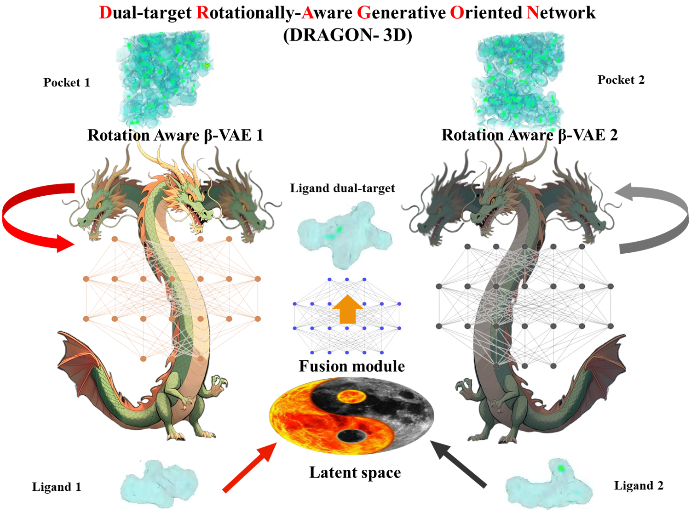

# Dragon-3D

<div align=center>

</div>

## Section 1: Setup Environment
You can follow the instructions to setup the conda environment

```shell
conda env create -f dragon-3D_env.yml -n dragon-3D
conda activate dragon-3D
```


## Section 2: Generation

### Run Dragon-3D on the test examples
1. Please setup the env dependencies
2. Just change to the base directory and run the `zzx_Generate.py` with prepared yml file

**for denovo generation**
```shell
python zzx_Generate.py
```


### Run Dragon-3D on your own targets

For the denovo generation task, prepare your receptor PDB file and modify the example `./configs/zzx_gen_A_B_dual_example.yml` file.

- setting the `output_dir`, `receptor_A` and `receptor_B` parameters to your designated output path and receptor files.
- specifying the `x_A`, `y_A`, and `z_A` parameters as the center coordinates of the pocket_A.
- specifying the `x_B`, `y_B`, and `z_B` parameters as the center coordinates of the pocket_B.

```shell
python zzx_Generate.py --config ./configs/your.yml
```

## Section 3: Training your own dual-target drug models
1. Please modify the training file dependency paths according to your local environment.

2. Just run the `zzx_pocED_2_ligED_train_biNet_0.py`, `zzx_GPPM_train_accelerate.py`, `zzx_GFPM.py` and `zzx_TAPM_train_AMP.py` sequentially.


## Section 4: Training Dataset
The training data is located in the `training_dataset` directory of this project repository.


## Section 5: License

MIT

## Acknowledgement

This project is partially inspired by and built upon the ED2Mol project:

ED2Mol: https://github.com/pineappleK/ED2Mol

ED2Mol: Nat Mach Intell 7, 1355–1368 (2025). https://doi.org/10.1038/s42256-025-01095-7

We thank the original authors for making their code publicly available.

